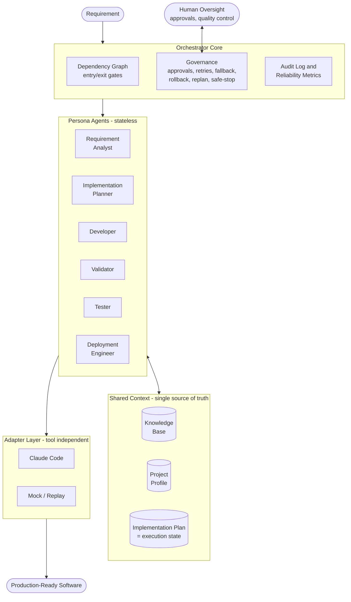

# AI SDLC Platform

**Spec-driven, AI-agent-executed software development under human governance.**

An agentic software engineering framework that transforms a requirement into production-ready software through a governed, multi-stage SDLC pipeline - with AI agents doing the work and humans owning oversight, approvals, and final quality.

> The URL shortener built with this framework is just the first demo. The framework itself is the product: it is designed to build **any** software project - greenfield, brownfield, bug fix, or enhancement.

## Core Idea

```
Requirement
    |
    v
Requirement Analysis
    |
    v
Implementation Plan  (= persistent execution state)
    |
    v
Development <-> Validation <-> Testing
    |
    v
Deployment
```

The framework follows **spec-driven development**: specifications (requirement analysis, implementation plan) are the source of truth, and agents generate code from specs - never the other way around. What sets it apart from classic spec-driven tooling is that execution is **stateful and governed**: a dependency graph with gates, human approvals, bounded retries, fallback, rollback, and dynamic re-planning.

- **Knowledge Base** - functional docs, technical docs, architecture, API/DB design, coding standards. Every agent reasons against this context. The KB has a lifecycle: greenfield plans MUST end with a documentation task that writes it (functional overview, technical architecture, API reference, data model); every bug fix or enhancement plan updates the affected documents in the same plan as the code - so brownfield work always starts from current, versioned documentation.
- **Project Profile** - the project's stack and conventions, established once and used by every agent.
- **Implementation Plan as execution state** - every task carries a status (pending / in_progress / waiting_approval / completed / blocked / rolled_back) in a small yaml block that only the orchestrator writes. It is the single source of truth, which also gives the framework **resume capability**: stop anytime (Ctrl+C is safe), then run `ai-sdlc develop` again - it always continues from the current state.
- **Stateless persona agents** - Requirement Analyst, Implementation Planner, Developer, Validator, Tester, Deployment Engineer. Each derives all context from the Knowledge Base, Project Profile, and current Plan.
- **Tool-independent adapters** - implemented today: Claude Code (headless) and a deterministic Mock for offline runs, tests, and fallback.

## Prerequisites

| Requirement | Why | Check |
|---|---|---|
| Python 3.11+ | the framework is a Python package | `py --version` (Windows) or `python3 --version` |
| pip | installs the framework | `py -m pip --version` |
| git | per-task commits, rollback, feature branches | `git --version` |
| Node.js 18+ | required by the Claude Code CLI installer | `node --version` |
| Claude Code CLI | the real AI adapter (`claude` must be on PATH) | `claude --version` |
| Claude subscription or API key | Claude Code needs an authenticated session | run `claude` once and sign in |

Notes:
- **Mock-only usage needs none of the Claude/Node rows.** The framework, its tests, and offline demos run fully without an LLM.
- Install Claude Code: `npm install -g @anthropic-ai/claude-code` (or the native installer from Anthropic docs), then run `claude` once to authenticate.

## Getting Started - step by step

### Step 1: Install the framework (once per machine)

Just use it - one line, no clone needed:

```
py -m pip install git+https://github.com/rajagopalbaskaran/ai-sdlc.git
```

Or develop it - clone and install editable:

```
git clone https://github.com/rajagopalbaskaran/ai-sdlc.git
cd ai-sdlc
py -m pip install -e .[dev]
py -m pytest            # optional: 81 tests, all offline, ~10s
```

Either way the installed package is named `ai-sdlc` (check with `pip show ai-sdlc`) and the `ai-sdlc` command lands on your PATH. Like git: the tool is installed once; each project gets its own state folder.

### Step 2: Create your project workspace

```
mkdir my-app
cd my-app
git init                # enables per-task commits, rollback, branches
ai-sdlc init            # plants the .ai-sdlc/ state folder
```

`init` creates the templates you will fill in:

```
my-app/
  .ai-sdlc/
    config.yaml           <- adapter and governance settings
    project-profile.md    <- your stack (fill this in, step 3)
    knowledge-base/       <- project docs (fill this in, step 3)
    plan/
      implementation-plan.md   <- starts empty; the planner fills it
    personas/             <- 6 agent definitions (customizable)
    runs/                 <- audit logs, metrics, reports
```

### Step 3: Fill in the templates

1. **`.ai-sdlc/project-profile.md`** - your stack, so agents never have to ask:

```markdown
# Project Profile
- Language: Python 3.11
- Framework: FastAPI
- Database: SQLite
- Testing: pytest
- Run command: uvicorn app.main:app
- Conventions: type hints everywhere, black formatting
```

2. **`.ai-sdlc/knowledge-base/`** - drop in markdown docs the agents should know: architecture decisions, API conventions, coding standards, existing module descriptions (for brownfield work). For a brand new project this can start empty; agents will grow it.

3. **`.ai-sdlc/config.yaml`** - pick your adapter and governance settings:

```yaml
adapter: claude-code        # or: mock (offline dry-runs)
fallback_adapters: [mock]   # tried in order if the primary fails
retry_budget: 2
parallel: false
commit_mode: auto           # auto | ask | off (per-task local commits)
diff_limit: 500
approval_gates: [plan, deploy_ready]
claude_command: claude
task_timeout_seconds: 600
```

4. **`.ai-sdlc/personas/*.md`** (optional) - tune the six agent definitions for this project, e.g. add rules to `developer.md`.

### Step 4: Write your requirement

Any plain markdown/text file, anywhere in the workspace:

```markdown
# requirement.md
Build a URL shortener service:
- POST /shorten accepts a long URL, returns a short code
- GET /{code} redirects to the original URL
- GET /stats/{code} returns click count
- SQLite storage, input validation, tests included
```

### Step 5: Run the pipeline

```
ai-sdlc analyze requirement.md   # agent writes plan/requirement-analysis.md
#   -> commits the [ai-sdlc:analysis] snapshot: what the agent saw
#      (requirement, profile, KB) and what it concluded (raw analysis)
#   -> YOU review it: answer ambiguity questions, fix wrong assumptions

ai-sdlc plan                     # agent appends tasks to implementation-plan.md
#   -> first commits the [ai-sdlc:requirement] snapshot: your REVIEWED
#      analysis (diff vs the raw snapshot = evidence of human review)
#   -> YOU review the tasks and dependencies in your editor
#   -> greenfield plans end with a knowledge-base documentation task

ai-sdlc develop                  # asks: Approve the implementation plan? [a/r/m]
#   -> agents execute task by task on a feature branch:
#      retries (validation failures feed back into the next attempt),
#      policy checks, per-task commits, audit logging
#   -> at the end (if a git remote exists): Push branch? [a/r/m]
```

You type framework commands in the terminal. You never prompt the AI directly - the framework calls Claude Code headless behind the scenes, one governed task at a time.

### Step 6: Observe, steer, recover

```
ai-sdlc status                   # every task and its state
ai-sdlc report                   # metrics + timeline markdown
Ctrl+C                           # safe-stop anytime, state stays consistent
ai-sdlc develop                  # run again anytime - always continues from
                                 #   current state; offers to retry blocked
                                 #   tasks after you fix their causes
ai-sdlc rollback T3              # revert exactly task T3 (confirmation-gated)
ai-sdlc replan changed-req.md    # requirement changed mid-flight:
                                 #   diff plan, keep completed work, re-approve
ai-sdlc push                     # publish the feature branch (confirmation-gated)
```

There is exactly one execution verb. When tasks block, the framework tells
you which and why, both at the end of the run and the next time you start
one - and asks whether to retry them. You never memorize system state; the
system presents its state with the next action attached.

## CLI Reference

```
ai-sdlc init                       # plant .ai-sdlc/ into the workspace
ai-sdlc analyze <requirement-file> # requirement -> analysis + clarifications
ai-sdlc plan                       # analysis -> implementation plan
ai-sdlc develop [--parallel] [--retry-blocked]
                                   # execute the plan - safe to run anytime,
                                   # always continues from current state (alias: run)
ai-sdlc status                     # show task states
ai-sdlc report                     # audit log + metrics -> markdown
ai-sdlc rollback <task-id> [--yes] # revert one task's commit
ai-sdlc replan [req] [--proposal file] [--yes]  # absorb a requirement change
ai-sdlc push [--yes]               # push the feature branch to origin
ai-sdlc summarize                  # generate the engineering summary
```

## Architecture Overview



## What Asks Permission and What Does Not

Know exactly which actions prompt you and which run automatically:

| Action | Prompts you? | Notes |
|---|---|---|
| Execute the implementation plan | YES - approve/reject/modify | Nothing runs without this; the approval persists so it is asked once per plan |
| Branch creation | Recommends, you decide | The recommendation is named after the requirement being executed - `feature/<subject>` for new work, `fix/<subject>` for bug fixes (derived from the analysis title; workspace name as fallback). Interactive runs ask: `Branch for this work [Enter = <recommendation>]` - press Enter to accept or type your own. Unattended runs take the recommendation silently. The choice and its source are recorded in the plan and audit |
| Per-task local commits | Depends on `commit_mode` | `auto` (default): commits happen automatically as rollback save-points - local only, nothing leaves your machine. `ask`: prompts before every commit. `off`: no per-task commits (rollback by task becomes unavailable) |
| Stage-artifact snapshots | Depends on `commit_mode` | analyze commits the raw analysis snapshot; plan commits the reviewed one. Same auto/ask/off rules; in ask mode, declining the planning snapshot aborts planning - tasks may never derive from unversioned upstream |
| Push to a remote | YES - every time | Never automatic, never remembered; no remote configured means no push at all |
| Deploy-ready sign-off | YES | Final quality gate when all tasks are green |
| Rollback / replan | YES | Confirmation prompts (or explicit `--yes`) |

Two design rules behind this table:

1. Local and reversible actions (branch creation, local commits under `auto`)
   do not interrupt you - prompting for zero-risk bookkeeping causes approval
   fatigue, which erodes attention at the gates that matter.
2. Anything that publishes or destroys (push, rollback) always asks, and
   non-interactive sessions reject by default - the framework can never
   approve on your behalf.

## Governance and Controlled Autonomy

Agents execute under defined autonomy boundaries; humans stay in control:

- Explicit dependency graph (cycle-checked) with entry/exit gates between stages
- Human approval checkpoints (approve / reject / modify) for plan acceptance, deploy-readiness, rollback, replan, and push; plan approvals persist; non-interactive sessions never auto-approve
- Bounded retries with the failure context fed back into the next attempt
- Adapter fallback chain: if the primary AI tool fails, the next one takes over (audited)
- Change detection: the framework diffs the workspace around every task, so policy checks run on what actually changed - secrets, out-of-workspace writes, oversized diffs block the task
- Feature-branch lifecycle: agents work on a branch recorded in the plan; main stays clean; pushing is asked every time, never automatic
- Per-task local commits ([ai-sdlc:Tn]) as rollback save-points; `ai-sdlc rollback` reverts exactly one task
- Dynamic re-planning: requirement changed mid-flight -> diff the plan, protect completed work, revise pending tasks, re-approve; a stale-analysis gate refuses to execute a plan whose analysis changed after approval
- Safe-stop: interrupt at any point; state on disk stays consistent and rerunning develop resumes it
- Validation inside the retry loop: a policy-rejected output is a failed attempt whose reason feeds the next try; the agent self-corrects within the bounded budget, then blocks for the human
- Approval integrity: a new analysis or newly appended tasks revoke the prior plan approval (and deploy-ready sign-off) - unreviewed work can never execute under an old approval; a new requirement also releases the branch pin so its work gets its own branch
- Stage lineage in git: requirement -> raw analysis -> reviewed analysis -> approved plan -> per-task commits, each frozen before the next stage consumes it
- Audit-grade observability: append-only JSONL log of every agent call, gate decision, approval, retry, fallback, rollback, branch, and push
- Reliability metrics: success rate, retry/rollback frequency, MTTR, end-to-end latency, and latency by stage

## Development (contributing to the framework)

```
py -m pip install -e .[dev]
py -m pytest              # 81 tests, all offline (Mock adapter), ~10s
```

Test coverage includes: plan parsing round-trips, plan metadata, DAG eligibility and cycle detection, gate logic, scripted adapter failures, retry exhaustion, fallback switching, change detection, policy violations, real git commit/rollback/branch/push (against a local bare remote), parallel overlap, safe-stop/resume, approval persistence, replan merge rules, stale-analysis gate, and a full pipeline integration run.

## Documentation

- [docs/architecture.md](docs/architecture.md) - components, orchestration model, control flow, key decisions
- [docs/design.md](docs/design.md) - the original design and requirement traceability
- [docs/testing-and-limitations.md](docs/testing-and-limitations.md) - testing approach, limitations, trade-offs
- [docs/plans/](docs/plans/) - the implementation plan the framework itself was built from

## Demos (next phase)

1. **Greenfield** - build a URL shortener service from a requirement
2. **Brownfield** - fix a bug in the generated codebase (impact analysis from the knowledge base)
3. **Ambiguous** - "links should expire": surface ambiguities, record clarifications, replan, implement

## Status

Core framework complete and hardened (change detection, rollback, replan, branch lifecycle, per-stage metrics). Demo scenarios and full documentation in progress.
