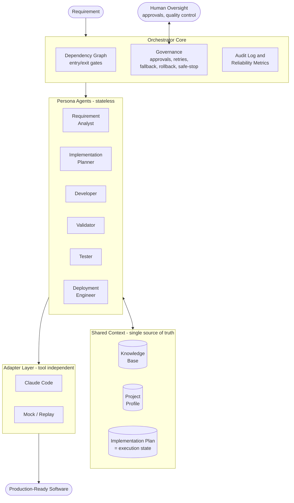

# AI SDLC Platform

**Spec-driven, AI-agent-executed software development under human governance.**

An agentic software engineering framework that transforms a requirement into production-ready software through a governed, multi-stage SDLC pipeline - with AI agents doing the work and humans owning oversight, approvals, and final quality.

> The URL shortener built with this framework is just the first demo. The framework itself is the product: it is designed to build **any** software project - greenfield, brownfield, bug fix, or enhancement.

## Core Idea

```
Requirement
    |
    v
Requirement Analysis
    |
    v
Implementation Plan  (= persistent execution state)
    |
    v
Development <-> Validation <-> Testing
    |
    v
Deployment
```

The framework follows **spec-driven development**: specifications (requirement analysis, implementation plan) are the source of truth, and agents generate code from specs - never the other way around. What sets it apart from classic spec-driven tooling is that execution is **stateful and governed**: a dependency graph with gates, human approvals, bounded retries, rollback, and dynamic re-planning.

- **Knowledge Base** - functional docs, technical docs, architecture, API/DB design, coding standards. Every agent reasons against this context.
- **Project Profile** - the project's stack and conventions (language, framework, database, testing tools), established once and used by every agent.
- **Implementation Plan as execution state** - the plan is not just a document; every task carries a status (pending / in_progress / waiting_approval / completed / blocked / rolled_back) in a small yaml block that only the orchestrator writes. Agents read it, execute against it, and update it. It is the single source of truth, which also gives the framework **resume capability**: stop anytime (Ctrl+C is safe), then `ai-sdlc continue` picks up exactly where work left off.
- **Stateless persona agents** - Requirement Analyst, Implementation Planner, Developer, Validator, Tester, Deployment Engineer. Each has defined responsibilities, inputs, outputs, and constraints; each derives all context from the Knowledge Base, Project Profile, and current Plan.
- **Tool-independent adapters** - the framework defines capabilities; adapters translate them to a specific AI coding assistant. Implemented today: Claude Code (headless) and a deterministic Mock for offline runs, tests, and fallback.

## How It Works (like git)

The engine is installed once; each target project gets its own state folder:

```
pip install -e .          # install the tool once (from this repo)
cd any-project
ai-sdlc init              # plants .ai-sdlc/ into the project
```

```
any-project/
  .ai-sdlc/               # travels WITH the project (like .git/)
    config.yaml           # adapter choice, retry budget, gates
    project-profile.md    # stack and conventions, set once
    knowledge-base/       # docs every agent reads
    plan/                 # implementation-plan.md = execution state
    personas/             # agent definitions, customizable per project
    runs/                 # audit logs, metrics, reports
  src/ ...                # the application (built by the agents)
```

## CLI

```
ai-sdlc init                       # plant .ai-sdlc/ into the workspace
ai-sdlc analyze <requirement-file> # requirement -> analysis + clarifications
ai-sdlc plan                       # analysis -> implementation plan
ai-sdlc run [--parallel]           # execute the plan (approval gate first)
ai-sdlc continue                   # resume from current state
ai-sdlc status                     # show task states
ai-sdlc report                     # audit log + metrics -> markdown
```

## Architecture Overview



Every persona agent reads its context from the Knowledge Base, Project Profile, and Implementation Plan, executes through an adapter, and writes results and status back to the Plan. The orchestrator core decides which agents run, in what order, and enforces gates and approvals in between.

## Governance and Controlled Autonomy

Agents execute under defined autonomy boundaries; humans stay in control:

- Explicit dependency graph (cycle-checked) with entry/exit gates between stages
- Human approval checkpoints (CLI: approve / reject / modify) for the plan and deploy-readiness; approvals persist across runs; non-interactive sessions never auto-approve
- Bounded retries with the failure context fed back into the next attempt
- Adapter fallback chain: if the primary AI tool fails, the next one takes over (audited)
- Per-task git commits in the target workspace with one-command rollback (git revert), never pushed
- Safe-stop: interrupt at any point; state on disk stays consistent and resumable
- Policy guardrails on every task output: secret detection, no writes outside the workspace, diff size limits
- Audit-grade observability: append-only JSONL log of every agent call, gate decision, approval, retry, fallback, and rollback
- Reliability metrics from the log: success rate, retry/rollback frequency, MTTR, end-to-end latency
- Parallel execution of independent tasks with the stage exit gate as the synchronization barrier

## Development

```
pip install -e .[dev]
pytest                    # 50 tests, all offline (Mock adapter), ~2s
```

Test coverage includes: plan parsing round-trips, DAG eligibility and cycle detection, gate logic, scripted adapter failures, retry exhaustion, fallback switching, policy violations, real git rollback, parallel overlap, safe-stop/resume, approval persistence, and a full pipeline integration run.

## Demos (next phase)

1. **Greenfield** - build a URL shortener service from a requirement
2. **Brownfield** - fix a bug in the generated codebase (impact analysis from the knowledge base)
3. **Ambiguous** - "links should expire": surface ambiguities, record clarifications, re-plan, implement

## Status

Core framework complete and tested. Demo scenarios and full documentation in progress.
