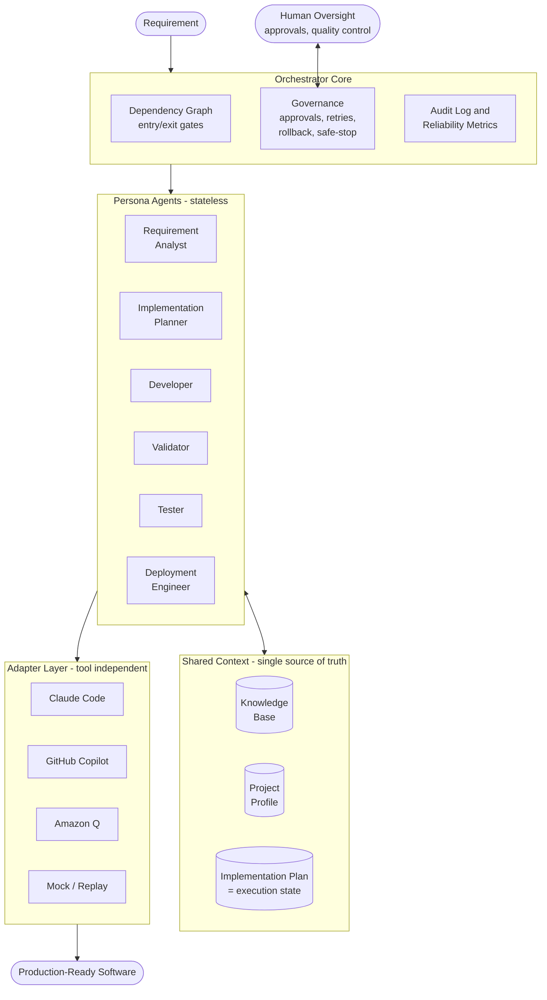

# Agentic SDLC Platform

**Spec-driven, AI-agent-executed software development under human governance.**

An agentic software engineering framework that transforms a requirement into production-ready software through a governed, multi-stage SDLC pipeline - with AI agents doing the work and humans owning oversight, approvals, and final quality.

> The URL shortener built with this framework is just the first demo. The framework itself is the product: it is designed to build **any** software project - greenfield, brownfield, bug fix, or enhancement.

## Core Idea

```
Requirement
    |
    v
Requirement Analysis
    |
    v
Implementation Plan  (= persistent execution state)
    |
    v
Development <-> Validation <-> Testing
    |
    v
Deployment
```

The framework follows **spec-driven development**: specifications (requirement analysis, implementation plan) are the source of truth, and agents generate code from specs - never the other way around. What sets it apart from classic spec-driven tooling is that execution is **stateful and governed**: a dependency graph with gates, human approvals, bounded retries, rollback, and dynamic re-planning.

- **Knowledge Base** - functional docs, technical docs, architecture, API/DB design, coding standards. Every agent reasons against this context.
- **Project Profile** - the project's stack and conventions (language, framework, database, testing tools), established once and used by every agent.
- **Implementation Plan as execution state** - the plan is not just a document; every task carries a status (Completed / In Progress / Pending / Waiting Approval / Blocked). Agents read it, execute against it, and update it. It is the single source of truth, which also gives the framework **resume capability**: stop anytime, then "continue development" picks up exactly where work left off.
- **Stateless persona agents** - Requirement Analyst, Implementation Planner, Developer, Validator, Tester, Deployment Engineer. Each has defined responsibilities, inputs, outputs, and constraints; each derives all context from the Knowledge Base, Project Profile, and current Plan.
- **Tool-independent adapters** - the framework defines capabilities; adapters translate them to a specific AI coding assistant (Claude Code, GitHub Copilot, Amazon Q, Cursor, or a deterministic Mock for offline/testing).

## Architecture Overview



Every persona agent reads its context from the Knowledge Base, Project Profile, and Implementation Plan, executes through an adapter, and writes results and status back to the Plan. The orchestrator core decides which agents run, in what order, and enforces gates and approvals in between.

## Governance and Controlled Autonomy

Agents execute under defined autonomy boundaries; humans stay in control:

- Explicit dependency graph with entry/exit gates between stages
- Human approval checkpoints for high-impact actions
- Bounded retries, fallback, rollback, and safe-stop controls
- Audit-grade logging and traceability of every agent action and decision
- Reliability metrics: success rate, retry/rollback frequency, MTTR, end-to-end latency
- Dynamic re-planning when upstream outputs change

## Demos (planned)

1. **Greenfield** - build a URL shortener service from a requirement
2. **Brownfield** - fix a bug in the existing codebase
3. **Ambiguous** - take a vague enhancement request, surface ambiguities, and normalize it into an executable plan

## Status

Design phase. Architecture and scope are being finalized before implementation begins.
