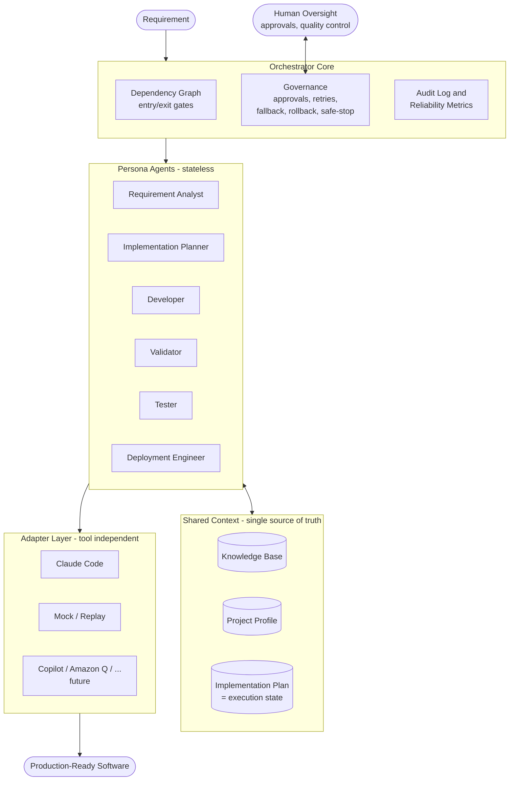

# AI SDLC Platform - Design and Validation

Status: IMPLEMENTED. This is the design the core framework was built from;
see architecture.md for the as-built view and testing-and-limitations.md
for verification and known constraints.
Date: 2026-08-07 (design), implemented over the following days

This document captures the full design converged in discussion, plus a
requirement-by-requirement validation against the interview assignment
(url-shornter-ai-sdlc.md).

---

## 1. Positioning

**AI SDLC Platform** - spec-driven, AI-agent-executed software development
under human governance.

The URL shortener is only Demo #1. The product is a generic framework that
transforms a requirement into production-ready software for ANY project:
greenfield, brownfield, bug fix, or enhancement.

Core philosophy (spec-driven development):

- Specifications (requirement analysis, implementation plan) are the source
  of truth. Agents generate code from specs - never the other way around.
- Execution is stateful and governed: dependency graph with gates, human
  approvals, bounded retries, rollback, dynamic re-planning.

## 2. Decisions Locked

| # | Decision | Choice |
|---|----------|--------|
| 1 | Tech stack | Python (FastAPI for demo app, plain Python for framework) |
| 2 | Orchestration | Custom-built engine (no LangGraph etc.) reflecting the converged architecture |
| 3 | Execution adapters | Claude Code (headless `claude -p`) + Mock/replay for offline and tests |
| 4 | Human approvals | CLI prompt at gates (approve / reject / modify) |
| 5 | State storage | Markdown plan with fenced yaml block per task; append-only JSONL audit log; markdown reports rendered from it |
| 6 | Demo arc | One app, three acts: build (greenfield) -> find and fix bug (brownfield) -> enhance from ambiguous requirement |
| 7 | Packaging | Framework is an installable Python module; `ai-sdlc init` plants a `.ai-sdlc/` state folder into any target workspace (like git: tool installed once, state per project) |
| 8 | Git identity | rajagopalbaskaran <Rajagopal.Baskaran@gmail.com>, repo-local config; no commits/pushes without explicit user instruction |
| 9 | File hygiene | Plain ASCII only in all files (no unicode arrows/dashes) |

## 3. Packaging Model

The framework is brought TO the workspace, not apps into the framework.

```
ai-sdlc repo                    = the framework package + docs + demos
any-app-workspace/              = e.g. url-shortener/
  .ai-sdlc/                     = planted by `ai-sdlc init`, travels with project
    config.yaml                 = adapter choice, retry budget, gate policy
    project-profile.md          = stack and conventions, set once
    knowledge-base/             = functional/technical docs, API/DB design, standards
    plan/                       = implementation-plan.md (execution state), analyses
    personas/                   = copied at init, customizable per project
    runs/                       = audit JSONL + metrics per run
  src/
  tests/
```

Engine code (orchestrator, adapters, governance) is NEVER copied per project -
installed once (`pip install -e .`), fixed once. Personas and state are copied
per project - cheap, customizable, diffable in the project's own git history.

## 4. Architecture



### 4.1 Orchestrator core

Stage DAG: `analyze -> plan -> [develop, validate, test] -> deploy-ready`.

- Each stage has an ENTRY gate (dependencies satisfied, required artifacts
  exist) and an EXIT gate (outputs validated, approval where required).
- Within development, the task DAG comes from the Implementation Plan
  (`depends_on` per task).
- Loop: read plan -> pick next eligible task(s) -> dispatch persona via
  adapter -> validate output -> update plan + audit -> repeat.
- Stop conditions: gate failure, approval pending, retry budget exhausted,
  safe-stop (Ctrl+C leaves state consistent - this doubles as the resume demo).

### 4.2 Parallel execution and synchronization

Independent tasks (no dependency path between them) run concurrently via a
thread pool. The stage EXIT gate is the synchronization barrier: the stage
completes only when all its tasks reach a terminal status. Parallelism is
demonstrated with the Mock adapter (deterministic); Claude Code runs default
to sequential via config.

### 4.3 Personas

Each persona is a markdown definition: responsibility, inputs, outputs,
rules, constraints. Tool-independent (capabilities, not slash commands).
Personas: Requirement Analyst, Implementation Planner, Developer, Validator,
Tester, Deployment Engineer. Agents are stateless - all context comes from
Knowledge Base + Project Profile + current Plan.

### 4.4 Adapters

Single interface: `execute(persona, context, task) -> result`.

- ClaudeCodeAdapter: invokes `claude -p` headless with assembled context.
- MockAdapter: deterministic canned outputs for offline demos and tests.
- Adapter fallback chain is configurable (see governance).

## 5. State Model

### 5.1 Implementation Plan = execution state

`implementation-plan.md`: human-readable markdown; each task carries one
fenced yaml block that the orchestrator ALONE writes:

    ### Task 3: Create redirect endpoint

    ```yaml
    id: T3
    status: pending   # pending | in_progress | waiting_approval |
                      # completed | blocked | rolled_back
    depends_on: [T1, T2]
    persona: developer
    artifacts: []
    derived_from: [analysis.md#redirect]   # decision lineage
    ```

    Implement GET /{code} resolving the short code, returning 302 ...

Single source of truth. `ai-sdlc continue` resumes from it - no context lost
between sessions.

### 5.2 Knowledge Base and Project Profile

- Knowledge Base: functional docs, technical docs, architecture, API/DB
  design, coding standards. Agents must read before acting and update as the
  app evolves (docs stay current with code).
- Project Profile: stack and conventions established once; agents never
  re-ask.

## 6. Governance and Controlled Autonomy

| Control | Mechanism |
|---------|-----------|
| Approvals | CLI gate: approve / reject / modify. Required for: plan acceptance, deploy-readiness, rollback, ambiguity resolutions |
| Retries | Per-task bounded (default 2), failure context fed back on retry; then task -> blocked |
| Fallback (adapter) | Configured chain, e.g. claude-code -> mock; switch is audited |
| Fallback (task) | On retry exhaustion, execute the task's declared fallback action (degrade scope or park for human) instead of stalling |
| Rollback | Per-task local git commits in the app workspace (never pushed); rollback = git revert + status rolled_back + audit event |
| Safe-stop | Any interrupt leaves plan + audit consistent; resume via `continue` |
| Re-planning | On requirement/upstream change: Planner diffs the plan, preserves completed tasks, revises affected pending ones; revised plan passes the approval gate again |
| Policy guardrails | Validator checklist per task output: no secrets, tests exist for new endpoints, no writes outside workspace, diff size limits |

## 7. Observability

- Append-only `runs/audit-<run-id>.jsonl`: every agent call, gate decision,
  approval, retry, fallback, rollback - timestamped, with artifact refs.
- Decision lineage: gate and replan events log structured decision records
  (options considered, choice, reason); artifacts carry `derived_from`.
- Metrics computed from the log: success rate, retry/rollback frequency,
  MTTR (failure -> recovered), end-to-end latency per stage.
- `ai-sdlc report` renders audit + metrics to human-readable markdown.

## 8. CLI

```
ai-sdlc init                       # plant .ai-sdlc/ into current workspace
ai-sdlc analyze <requirement-file> # requirement -> analysis + clarifications
ai-sdlc plan                       # analysis -> implementation plan (gate)
ai-sdlc run                        # execute plan (develop/validate/test loop)
ai-sdlc continue                   # resume after stop
ai-sdlc status                     # plan state + gates
ai-sdlc report                     # audit + metrics -> markdown
```

## 9. Demos - one app, three acts

1. Greenfield - "Build a URL shortener": POST /shorten (optional custom
   alias), GET /{code} redirect, GET /stats/{code} analytics, SQLite,
   validation, tests, docs.
2. Brownfield - bug report against the built app (e.g. duplicate short codes
   under concurrent requests): KB consultation, impact analysis, targeted
   fix, regression test, no unrelated changes.
3. Ambiguous - "links should expire": Analyst surfaces ambiguities (time vs
   click count? per-link config? behavior on access - 404/410/page? extend
   expiry?), CLI clarification checkpoint, assumptions recorded, plan,
   implementation. Also demonstrates re-planning.

## 10. Testing Approach

- Framework: pytest unit tests (DAG, gates, plan parsing, retry, fallback,
  rollback) + one integration test running the full pipeline on MockAdapter -
  fast, deterministic, no LLM required.
- App: generated tests from Demo 1, extended by Demos 2-3.

## 11. Deliverables Mapping

| Assignment deliverable | Where |
|------------------------|-------|
| Working prototype | framework package + demos, runnable end-to-end |
| Architecture overview | README + docs/architecture.md |
| Three scenarios | demo runs + docs/scenarios/ walkthroughs |
| Setup instructions | docs/setup.md |
| Testing approach, limitations, trade-offs | docs/testing.md, docs/limitations.md |
| Final engineering summary | docs/final-summary.md |

## 12. Requirement Traceability (revalidation)

| Assignment requirement | Design element | Status |
|---|---|---|
| Requirement understanding, ambiguity handling | Requirement Analyst + clarification gate (Demo 3) | Covered |
| Task decomposition with dependencies | Planner -> tasks with depends_on | Covered |
| Codebase reasoning (brownfield) | Knowledge Base + impact analysis (Demo 2) | Covered |
| Explicit dependency graph, entry/exit gates | Stage DAG + task DAG + gates | Covered |
| Sequential AND parallel paths + synchronization | Thread-pool execution of independent tasks; exit gate as barrier | Covered (gap fixed) |
| Cross-stage context + decision lineage | KB + plan + derived_from + decision records in audit | Covered (gap fixed) |
| Human approval checkpoints | CLI gates | Covered |
| Bounded retries, fallback, rollback, safe-stop | Retry budget; adapter + task fallback; git revert; consistent-state stop | Covered (fallback gap fixed) |
| Policy guardrails | Validator checklist | Covered |
| Audit-grade observability | Append-only JSONL per run | Covered |
| Metrics (success, retry/rollback, MTTR, latency) | Computed from audit log | Covered |
| Dynamic re-planning | Plan diff + re-approval gate | Covered |
| Production-quality output | Demo app + tests + docs | Covered |
| Risk/validation rigor | Validator persona + limitations doc | Covered |
| Controlled autonomy | Approval gates + persona autonomy boundaries | Covered |

## 13. Known Limitations (stated honestly)

- Single project per run.
- Claude Code adapter requires local Claude Code install; Mock adapter keeps
  demos and tests independent of it.
- Deployment stage produces readiness artifacts (runbook, checklist), not
  real infrastructure deployment.
- Parallel execution demonstrated with Mock adapter; LLM runs default to
  sequential for cost/safety.

## 14. Open Items

- None on design. Next steps: user reviews this document -> write
  implementation plan (task breakdown for the 2-3 day build) -> build with
  approval at each milestone.
